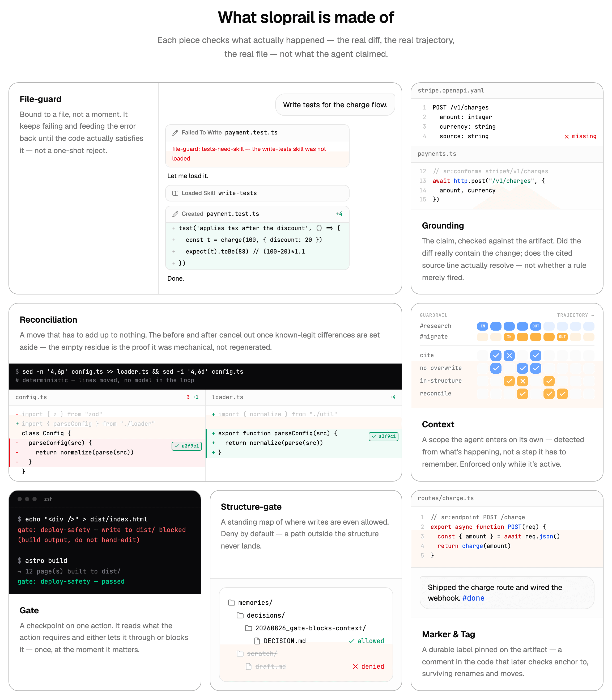

#  sloprail

Your agents slop. Take control.

Deterministic project rules for your coding agent. They kick in when it
touches a file or runs a command, and hold until met: files only where you
allow, right skills loaded first, work proven by diff or logs. Not a
suggestion in CLAUDE.md or AGENTS.md.



<!-- HERO GIF -->

## Install

```
/plugin marketplace add sloprail/sloprail
/plugin install sloprail@sloprail-marketplace
```

Pick the project scope. The first session after that installs the `sr*`
binaries the hooks call, once: the release matching the plugin's version,
checksum-verified, into `~/.local/bin`, and says so. From then on every tool
call and turn-end runs through sloprail — you don't run anything by hand.

Rather install the binaries yourself? Set `SLOPRAIL_NO_AUTO_INSTALL=1` and run

```
curl -fsSL https://raw.githubusercontent.com/sloprail/sloprail/main/install.sh | sh
```

(or `go install ./services/...` from a checkout).

## Rules first.

Usually the agent writes first and you fix it after. With sloprail the rules
come first, and they stay.

|   | Usually | With sloprail |
|---|---|---|
| 1 | You ask | You ask |
| 2 | Agent writes it all | **Agent writes the rules first** |
| 3 | You correct it | Agent builds inside them |
| 4 | Added to CLAUDE.md / SKILL.md, if you ask | Checked on every change; the rules stay |

## You've seen these happen

<!-- USE-CASE GRID -->

- [The task gets rewritten to match the work](https://sloprail.com/docs/use-cases/tasks/task-rewritten)
- [After enough compaction, it games the score instead of doing the work](https://sloprail.com/docs/use-cases/long-runs/compaction-gaming)
- [A request fell through the cracks](https://sloprail.com/docs/use-cases/tasks/request-fell-through)
- [The same fact, copied into two files, now disagreeing](https://sloprail.com/docs/use-cases/knowledge/duplicated-knowledge)
- [It acted without loading what it needed first](https://sloprail.com/docs/use-cases/knowledge/acted-without-context)
- [The "mechanical" refactor silently rewrote your code](https://sloprail.com/docs/use-cases/coding/refactor-regenerated)

## Docs → [sloprail.com/docs](https://sloprail.com/docs)

## How it works

A project declares guardrails under `.sloprail/`, one folder per rule, in the
directory named for its kind: `file-guard/` (what a file must hold), `gate/`
(a checkpoint on an action), `context/` (a mode other rules depend on), plus
one `file-guard/structure.yaml` listing where writes may land at all. The
harness calls the session hook points, and the engine runs whichever
guardrails bind to what is about to happen.

A file-guard's verdict only binds where it is enforced, so a project that has
file-guards must also run `sr-checks verify --base <default branch> --head <PR head sha>`
in CI on pull requests. The shipped gate `sloprail/gate/ci-verify-required`
refuses an agent's turn until the committed tree has a line containing
`sr-mark: ci-verify` (a comment beside that CI step, on any provider) and hands
back copy-paste snippets. Turn it off with `disabled: [sloprail/gate/ci-verify-required]`
in `.sloprail/config.yaml`.

Full docs, including how to write a guardrail:
[sloprail.com/docs](https://sloprail.com/docs).
